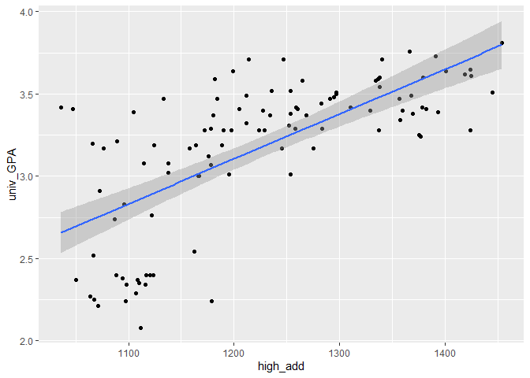

SAT and College Grades
================
(Your name here)
2020-

- <a href="#grading-rubric" id="toc-grading-rubric">Grading Rubric</a>
  - <a href="#individual" id="toc-individual">Individual</a>
  - <a href="#due-date" id="toc-due-date">Due Date</a>
- <a href="#obtain-the-data" id="toc-obtain-the-data">Obtain the Data</a>
  - <a
    href="#q1-visit-the-sat-and-college-gpa-case-study-page-scroll-to-the-bottom-and-click-the-open-data-with-excel-button-this-will-allow-you-to-download-an-xls-file-save-the-file-to-your-data-folder-load-the-data-as-df_sat-and-perform-your-first-checks-against-these-data-answer-the-questions-below"
    id="toc-q1-visit-the-sat-and-college-gpa-case-study-page-scroll-to-the-bottom-and-click-the-open-data-with-excel-button-this-will-allow-you-to-download-an-xls-file-save-the-file-to-your-data-folder-load-the-data-as-df_sat-and-perform-your-first-checks-against-these-data-answer-the-questions-below"><strong>q1</strong>
    Visit the SAT and College GPA case study page, scroll to the bottom, and
    click the <code>Open Data with Excel</code> button. This will allow you
    to download an <code>xls</code> file. Save the file to your
    <code>data</code> folder, load the data as <code>df_sat</code>, and
    perform your “first checks” against these data. Answer the questions
    below:</a>
- <a href="#analysis-with-hypothesis-testing"
  id="toc-analysis-with-hypothesis-testing">Analysis with Hypothesis
  Testing</a>
  - <a href="#view-1-correlations" id="toc-view-1-correlations">View 1:
    Correlations</a>
    - <a
      href="#q2-create-a-single-plot-that-shows-univ_gpa-against-both-high_gpa-and-both_sat-visually-compare-the-two-trends"
      id="toc-q2-create-a-single-plot-that-shows-univ_gpa-against-both-high_gpa-and-both_sat-visually-compare-the-two-trends"><strong>q2</strong>
      Create a <em>single</em> plot that shows <code>univ_GPA</code> against
      <em>both</em> <code>high_GPA</code> and <code>both_SAT</code>. Visually
      compare the two trends.</a>
    - <a href="#hypothesis-testing-with-a-correlation-coefficient"
      id="toc-hypothesis-testing-with-a-correlation-coefficient">Hypothesis
      Testing with a Correlation Coefficient</a>
    - <a
      href="#q3-plot-histograms-for-both_sat-high_gpa-univ_gpa-whichif-anyof-the-variables-look-approximately-normally-distributed"
      id="toc-q3-plot-histograms-for-both_sat-high_gpa-univ_gpa-whichif-anyof-the-variables-look-approximately-normally-distributed"><strong>q3</strong>
      Plot histograms for <code>both_SAT, high_GPA, univ_GPA</code>. Which—if
      any—of the variables look approximately normally distributed.</a>
    - <a
      href="#q4-use-the-function-cortest-to-construct-confidence-intervals-for-corrhigh_gpa-univ_gpa-and-corrboth_sat-univ_gpa-answer-the-questions-below"
      id="toc-q4-use-the-function-cortest-to-construct-confidence-intervals-for-corrhigh_gpa-univ_gpa-and-corrboth_sat-univ_gpa-answer-the-questions-below"><strong>q4</strong>
      Use the function <code>cor.test()</code> to construct confidence
      intervals for <code>corr[high_GPA, univ_GPA</code> and
      <code>corr[both_SAT, univ_GPA]</code>. Answer the questions below.</a>
    - <a
      href="#q5-use-the-bootstrap-to-approximate-a-confidence-interval-for-corrhigh_gpa-univ_gpa-compare-your-resultsboth-the-estimate-and-confidence-intervalto-your-results-from-q4"
      id="toc-q5-use-the-bootstrap-to-approximate-a-confidence-interval-for-corrhigh_gpa-univ_gpa-compare-your-resultsboth-the-estimate-and-confidence-intervalto-your-results-from-q4"><strong>q5</strong>
      Use the bootstrap to approximate a confidence interval for
      <code>corr[high_GPA, univ_GPA</code>. Compare your results—both the
      estimate and confidence interval—to your results from q4.</a>
  - <a href="#view-2-modeling" id="toc-view-2-modeling">View 2: Modeling</a>
    - <a href="#hypothesis-testing-with-a-model"
      id="toc-hypothesis-testing-with-a-model">Hypothesis Testing with a
      Model</a>
    - <a
      href="#q6-fit-a-linear-model-predicting-univ_gpa-with-the-predictor-both_sat-assess-the-model-to-determine-how-effective-a-predictor-both_sat-is-for-univ_gpa-interpret-the-resulting-confidence-interval-for-the-coefficient-on-both_sat"
      id="toc-q6-fit-a-linear-model-predicting-univ_gpa-with-the-predictor-both_sat-assess-the-model-to-determine-how-effective-a-predictor-both_sat-is-for-univ_gpa-interpret-the-resulting-confidence-interval-for-the-coefficient-on-both_sat"><strong>q6</strong>
      Fit a linear model predicting <code>univ_GPA</code> with the predictor
      <code>both_SAT</code>. Assess the model to determine how effective a
      predictor <code>both_SAT</code> is for <code>univ_GPA</code>. Interpret
      the resulting confidence interval for the coefficient on
      <code>both_SAT</code>.</a>
    - <a
      href="#q7-fit-a-model-predicting-univ_gpa-using-both-high_gpa-and-both_sat-compare-the-prediction-accuracy-and-hypothesis-test-results"
      id="toc-q7-fit-a-model-predicting-univ_gpa-using-both-high_gpa-and-both_sat-compare-the-prediction-accuracy-and-hypothesis-test-results"><strong>q7</strong>
      Fit a model predicting <code>univ_GPA</code> using both
      <code>high_GPA</code> and <code>both_SAT</code>. Compare the prediction
      accuracy and hypothesis test results.</a>
  - <a href="#synthesize" id="toc-synthesize">Synthesize</a>
    - <a
      href="#q8-using-the-results-from-all-previous-qs-answer-the-following-questions"
      id="toc-q8-using-the-results-from-all-previous-qs-answer-the-following-questions"><strong>q8</strong>
      Using the results from all previous q’s, answer the following
      questions.</a>
- <a href="#end-notes" id="toc-end-notes">End Notes</a>

*Purpose*: How do we apply hypothesis testing to investigating data? In
this challenge you’ll practice using hypothesis testing tools to make
sense of a dataset.

*Reading*: - [Harvard Study Says SATs Should Be Optional: Here’s
Why](https://www.csmonitor.com/USA/USA-Update/2016/0120/Harvard-study-says-SATs-should-be-optional.-Here-s-why)
(Optional); easy-to-read news article on colleges going SAT-free -
[Norm-Referenced Tests and Race-Blind
Admissions](https://cshe.berkeley.edu/publications/norm-referenced-tests-and-race-blind-admissions-case-eliminating-sat-and-act-university)
(Optional); technical report on relationship between the SAT/ACT and
non-academic factors

*Credit*: This is based on a [case
study](http://onlinestatbook.com/2/case_studies/sat.html) originally
prepared by Emily Zitek, with data collected through the research of
Thomas MacFarland.

``` r
library(tidyverse)
```

    ## ── Attaching packages ─────────────────────────────────────── tidyverse 1.3.2 ──
    ## ✔ ggplot2 3.4.1     ✔ purrr   1.0.1
    ## ✔ tibble  3.1.8     ✔ dplyr   1.1.0
    ## ✔ tidyr   1.3.0     ✔ stringr 1.5.0
    ## ✔ readr   2.1.4     ✔ forcats 1.0.0
    ## ── Conflicts ────────────────────────────────────────── tidyverse_conflicts() ──
    ## ✖ dplyr::filter() masks stats::filter()
    ## ✖ dplyr::lag()    masks stats::lag()

``` r
library(readxl)
library(broom)
library(modelr)
```

    ## 
    ## Attaching package: 'modelr'
    ## 
    ## The following object is masked from 'package:broom':
    ## 
    ##     bootstrap

``` r
library(rsample)
```

    ## Warning: package 'rsample' was built under R version 4.2.3

``` r
library(boot)
```

<!-- include-rubric -->

# Grading Rubric

<!-- -------------------------------------------------- -->

Unlike exercises, **challenges will be graded**. The following rubrics
define how you will be graded, both on an individual and team basis.

## Individual

<!-- ------------------------- -->

| Category    | Needs Improvement                                                                                                | Satisfactory                                                                                                               |
|-------------|------------------------------------------------------------------------------------------------------------------|----------------------------------------------------------------------------------------------------------------------------|
| Effort      | Some task **q**’s left unattempted                                                                               | All task **q**’s attempted                                                                                                 |
| Observed    | Did not document observations, or observations incorrect                                                         | Documented correct observations based on analysis                                                                          |
| Supported   | Some observations not clearly supported by analysis                                                              | All observations clearly supported by analysis (table, graph, etc.)                                                        |
| Assessed    | Observations include claims not supported by the data, or reflect a level of certainty not warranted by the data | Observations are appropriately qualified by the quality & relevance of the data and (in)conclusiveness of the support      |
| Specified   | Uses the phrase “more data are necessary” without clarification                                                  | Any statement that “more data are necessary” specifies which *specific* data are needed to answer what *specific* question |
| Code Styled | Violations of the [style guide](https://style.tidyverse.org/) hinder readability                                 | Code sufficiently close to the [style guide](https://style.tidyverse.org/)                                                 |

## Due Date

<!-- ------------------------- -->

All the deliverables stated in the rubrics above are due **at midnight**
before the day of the class discussion of the challenge. See the
[Syllabus](https://docs.google.com/document/d/1qeP6DUS8Djq_A0HMllMqsSqX3a9dbcx1/edit?usp=sharing&ouid=110386251748498665069&rtpof=true&sd=true)
for more information.

*Background*: Every year about 2 million students take the Scholastic
Aptitude Test (SAT). The exam is
[controversial](http://www.nea.org/home/73288.htm) but [extremely
consequential](https://www.csmonitor.com/2004/0518/p13s01-legn.html).
There are many claims about the SAT, but we’re going to look at just
one: Is the SAT predictive of scholastic performance in college? It
turns out this is a fairly complicated question to assess—we’ll get an
introduction to some of the complexities.

# Obtain the Data

<!-- -------------------------------------------------- -->

### **q1** Visit the [SAT and College GPA](http://onlinestatbook.com/2/case_studies/sat.html) case study page, scroll to the bottom, and click the `Open Data with Excel` button. This will allow you to download an `xls` file. Save the file to your `data` folder, load the data as `df_sat`, and perform your “first checks” against these data. Answer the questions below:

``` r
## TODO:
df_sat <- read_excel("./data/sat.xls")

## TODO: Do your "first checks"
df_sat %>% glimpse
```

    ## Rows: 105
    ## Columns: 5
    ## $ high_GPA <dbl> 3.45, 2.78, 2.52, 3.67, 3.24, 2.10, 2.82, 2.36, 2.42, 3.51, 3…
    ## $ math_SAT <dbl> 643, 558, 583, 685, 592, 562, 573, 559, 552, 617, 684, 568, 6…
    ## $ verb_SAT <dbl> 589, 512, 503, 602, 538, 486, 548, 536, 583, 591, 649, 592, 5…
    ## $ comp_GPA <dbl> 3.76, 2.87, 2.54, 3.83, 3.29, 2.64, 2.86, 2.03, 2.81, 3.41, 3…
    ## $ univ_GPA <dbl> 3.52, 2.91, 2.40, 3.47, 3.47, 2.37, 2.40, 2.24, 3.02, 3.32, 3…

**Observations**:

- Fill in the following “data dictionary”

| Column     | Meaning                |
|------------|------------------------|
| `high_GPA` | High school GPA        |
| `math_SAT` | Math SAT score         |
| `verb_SAT` | Verbal SAT score       |
| `comp_GPA` | Computer science GPA   |
| `univ_GPA` | Overall university GPA |

- What information do we have about these students?
  - (Your response here) Their major, SAT score, GPA from high school,
    computer science, and university, and that they are all from the
    same university.
- What kinds of information *do we not have* about these students?
  - (Your response here) Everything else about them, including high
    school activities.
- Based on these missing variables, what possible effects could be
  present in the data that we would have *no way of detecting*?
  - (Your response here) Academic dishonesty, and students taking
    different SAT exams could pose an issue.

# Analysis with Hypothesis Testing

<!-- ----------------------------------------------------------------------- -->

We’re going to use two complementary approaches to analyze the data, the
first based on hypothesis testing of correlation coefficients, and the
second based on fitting a regression model and interpreting the
regression coefficients.

To simplify the analysis, let’s look at a composite SAT score:

``` r
## NOTE: No need to edit this
df_composite <-
  df_sat %>%
  mutate(both_SAT = math_SAT + verb_SAT)
```

## View 1: Correlations

<!-- ----------------------------------------------------------------------- -->

### **q2** Create a *single* plot that shows `univ_GPA` against *both* `high_GPA` and `both_SAT`. Visually compare the two trends.

*Hint*: One way to do this is to first *pivot* `df_composite`.

``` r
## TODO:
df_composite %>% 
  ggplot(aes(x = high_GPA, y = univ_GPA)) + 
  geom_point(aes(color = both_SAT)) +
  scale_colour_gradient(low = "red", high = "green")
```

<!-- -->

**Observations**:

- What relationship do `univ_GPA` and `both_SAT` exhibit?
  - (Your response here) As seen from the color groupings, the red dots
    tend to be on the lower part of the graph, while the greener dots
    tend to be higher on the graph. This means that those with lower
    `both_SAT` values tend to have a lower `univ_GPA`.
- What relationship do `univ_GPA` and `high_GPA` exhibit?
  - (Your response here) Points tend to go from the bottom left to top
    right, which means that the higher the `high_GPA`, the higher the
    `univ_GPA`.

### Hypothesis Testing with a Correlation Coefficient

<!-- ------------------------- -->

We can use the idea of hypothesis testing with a correlation
coefficient. The idea is to set our null hypothesis to the case where
there is no correlation, and test to see if the data contradict that
perspective. Formally, the null (H0) and alternative (HA) hypotheses
relating to a correlation coefficient between two variables `X, Y` are:

$$\text{H0: } \text{Corr}[X, Y] = 0$$

$$\text{HA: } \text{Corr}[X, Y] \neq 0$$

The R function `cor.test` implements such a hypothesis test under the
assumption that `X, Y` are both normally distributed. First, let’s check
to see if this assumption looks reasonable for our data.

### **q3** Plot histograms for `both_SAT, high_GPA, univ_GPA`. Which—if any—of the variables look approximately normally distributed.

``` r
# df_composite %>% 
#   ggplot() +
#   geom_histogram(aes(x = both_SAT)) +
#   geom_histogram(aes(x = high_GPA)) +
#   geom_histogram(aes(x = univ_GPA))

ggplot(df_composite, aes(x = both_SAT)) + geom_histogram()
```

    ## `stat_bin()` using `bins = 30`. Pick better value with `binwidth`.

<!-- -->

``` r
ggplot(df_composite, aes(x = high_GPA)) + geom_histogram()
```

    ## `stat_bin()` using `bins = 30`. Pick better value with `binwidth`.

<!-- -->

``` r
ggplot(df_composite, aes(x = univ_GPA)) + geom_histogram()
```

    ## `stat_bin()` using `bins = 30`. Pick better value with `binwidth`.

<!-- -->

**Observations**:

- To what extent does `both_SAT` look like a normal distribution?
  - (Your response here) The counts taper off on either extremes,
    however the counts in between are quite evenly spread.
- To what extent does `high_GPA` look like a normal distribution?
  - (Your response here) It looks like there are two humps - as if there
    were two normal distributions next to each other. Counts taper out
    on either extremes but at the middle as well. (This is interesting
    as I heard many of my math teachers talk about how student grades
    exhibit this exact behavior.)
- To what extent does `univ_GPA` look like a normal distribution?
  - (Your response here) It is similar to the shape of `high_GPA`.
    However, the hump on the left is significantly smaller than the one
    on the right.

Keep in mind your findings as you complete q4.

### **q4** Use the function `cor.test()` to construct confidence intervals for `corr[high_GPA, univ_GPA` and `corr[both_SAT, univ_GPA]`. Answer the questions below.

``` r
## TODO: Use the function cor.test() to test the correlations between
##       high_GPA and univ_GPA, as well as between
##       both_SAT and univ_GPA
print("high_GPA vs. univ_GPA:")
```

    ## [1] "high_GPA vs. univ_GPA:"

``` r
cor.test(df_composite$high_GPA, df_composite$univ_GPA)
```

    ## 
    ##  Pearson's product-moment correlation
    ## 
    ## data:  df_composite$high_GPA and df_composite$univ_GPA
    ## t = 12.632, df = 103, p-value < 2.2e-16
    ## alternative hypothesis: true correlation is not equal to 0
    ## 95 percent confidence interval:
    ##  0.6911690 0.8449761
    ## sample estimates:
    ##       cor 
    ## 0.7795631

``` r
print(("both_SAT vs. univ_GPA:"))
```

    ## [1] "both_SAT vs. univ_GPA:"

``` r
cor.test(df_composite$both_SAT, df_composite$univ_GPA)
```

    ## 
    ##  Pearson's product-moment correlation
    ## 
    ## data:  df_composite$both_SAT and df_composite$univ_GPA
    ## t = 9.5339, df = 103, p-value = 8.052e-16
    ## alternative hypothesis: true correlation is not equal to 0
    ## 95 percent confidence interval:
    ##  0.5674824 0.7746821
    ## sample estimates:
    ##       cor 
    ## 0.6846776

**Observations**:

- Which correlations are significantly nonzero?
  - (Your response here) Both `[high_GPA, univ_GPA]` and
    `[both_SAT, univ_GPA]` have significant nonzero correlation.
- Which of `high_GPA` and `both_SAT` seems to be more strongly
  correlated with `univ_GPA`?
  - (Your response here) `high_GPA` has a bigger correlation
    coefficient.
- How do the results here compare with the visual you created in q2?
  - (Your response here) The visual exhibited signs of correlation
    between both parameters, which agrees with the correlation
    coefficients.
- Based on these results, what can we say about the predictive
  capabilities of both `high_GPA` and `both_SAT` to predict `univ_GPA`?
  - (Your response here) One could reasonably predict `univ_GPA` given
    `high_GPA` or `both_SAT`, or both.

Finally, let’s use the bootstrap to perform the same test using
*different* assumptions.

### **q5** Use the bootstrap to approximate a confidence interval for `corr[high_GPA, univ_GPA`. Compare your results—both the estimate and confidence interval—to your results from q4.

``` r
## TODO: Use the bootstrap to compute a confidence interval for corr[high_GPA, univ_GPA]
high_univ <- df_composite[, c("high_GPA", "univ_GPA")]

corr_func <- function(data) {
  return(cor.test(data[, 1], data[, 2]))
}

high_univ_boot <- bootstraps(data = high_univ, times = 1000) %>% 
  mutate(df = map(splits, ~ analysis(.x)))

corr_boot <- high_univ_boot$df

df_boot <- as.data.frame((do.call(rbind, corr_boot)))

cor.test(df_boot$high_GPA, df_boot$univ_GPA)
```

    ## 
    ##  Pearson's product-moment correlation
    ## 
    ## data:  df_boot$high_GPA and df_boot$univ_GPA
    ## t = 399.68, df = 104998, p-value < 2.2e-16
    ## alternative hypothesis: true correlation is not equal to 0
    ## 95 percent confidence interval:
    ##  0.7743774 0.7791752
    ## sample estimates:
    ##       cor 
    ## 0.7767876

**Observations**:

- How does your estimate from q5 compare with your estimate from q4?
  - (Your response here) The correlation value has not changed
    significantly from q4.
- How does your CI from q5 compare with your CI from q4?
  - (Your response here) The bootstrapped CI is much smaller than the
    one from q4.

*Aside*: When you use two different approximations to compute the same
quantity and get similar results, that’s an *encouraging sign*. Such an
outcome lends a bit more credibility to the results.

## View 2: Modeling

<!-- ------------------------- -->

Correlations are useful for relating two variables at a time. To study
the relationship among more variables we can instead use a fitted model.
Using a model, we can also help assess whether it is *worthwhile* to
measure a variable.

To begin, let’s first split the data into training and validation sets.

``` r
## NOTE: No need to edit
set.seed(101)

df_train <-
  df_composite %>%
  rowid_to_column() %>%
  slice_sample(n = 80)

df_validate <-
  df_composite %>%
  rowid_to_column() %>%
  anti_join(
    .,
    df_train,
    by = "rowid"
  )
```

### Hypothesis Testing with a Model

<!-- ------------------------- -->

We can combine the ideas of hypothesis testing with a model. Using a
model, we can express our hypotheses in terms of the model parameters.
For instance, if we were interested in whether $X$ has an affect on $Y$,
we might set up a model:

$$Y_i = \beta X_i + \epsilon_i$$

With the hypotheses:

$$\text{H0}: \beta = 0$$

$$\text{HA}: \beta \neq 0$$

In this case, we’re testing for whether $X$ has a significant effect on
$Y$. Let’s apply this idea to relating the variables `univ_GPA` and
`high_GPA`. Luckily R has built-in tools to construct a confidence
interval on the $\beta$’s in a regression \[1\]; we’ll simply use those
tools rather than do it by hand.

### **q6** Fit a linear model predicting `univ_GPA` with the predictor `both_SAT`. Assess the model to determine how effective a predictor `both_SAT` is for `univ_GPA`. Interpret the resulting confidence interval for the coefficient on `both_SAT`.

``` r
## TODO: Fit a model of univ_GPA on the predictor both_SAT
fit_basic <- lm(univ_GPA ~ both_SAT, data = df_composite)

## NOTE: The following computes confidence intervals on regression coefficients
fit_basic %>%
  tidy(
    conf.int = TRUE,
    conf.level = 0.99
  )
```

    ## # A tibble: 2 × 7
    ##   term        estimate std.error statistic  p.value conf.low conf.high
    ##   <chr>          <dbl>     <dbl>     <dbl>    <dbl>    <dbl>     <dbl>
    ## 1 (Intercept) -0.172    0.352       -0.487 6.27e- 1 -1.10      0.753  
    ## 2 both_SAT     0.00274  0.000287     9.53  8.05e-16  0.00198   0.00349

``` r
df_composite %>% 
  ggplot(aes(x = both_SAT, y = univ_GPA)) +
  geom_point() +
  geom_smooth(method = "lm")
```

    ## `geom_smooth()` using formula = 'y ~ x'

<!-- -->

**Observations**:

- What is the confidence interval on the coefficient of `both_SAT`? Is
  this coefficient significantly different from zero?
  - (Your response here) \[`conf.low` \~= 0.0019, `conf.high` \~=
    0.0034\] The coefficient is in an interval where it is significantly
    nonzero.
- By itself, how well does `both_SAT` predict `univ_GPA`?
  - (Your response here) With the plotted model, the trend is definitely
    present in the regression line. However, there seem to be many
    points outside the line or even the confidence interval.

Remember from `e-model03-interp-warnings` that there are challenges with
interpreting regression coefficients! Let’s investigate that idea
further.

### **q7** Fit a model predicting `univ_GPA` using both `high_GPA` and `both_SAT`. Compare the prediction accuracy and hypothesis test results.

``` r
## TODO: Fit and assess models with predictors both_SAT + high_GPA, and high_GPA alone
#--------------------- both_SAT + high_GPA
df_composite <- df_composite %>% 
  mutate(high_add = both_SAT + high_GPA)

df_composite %>% 
  ggplot(aes(x = high_add, y = univ_GPA)) +
  geom_point() +
  geom_smooth(method = "lm")
```

    ## `geom_smooth()` using formula = 'y ~ x'

<!-- -->

``` r
fit_add <- lm(univ_GPA ~ high_add, data = df_composite)

fit_add %>%
  tidy(
    conf.int = TRUE,
    conf.level = 0.99
  )
```

    ## # A tibble: 2 × 7
    ##   term        estimate std.error statistic  p.value conf.low conf.high
    ##   <chr>          <dbl>     <dbl>     <dbl>    <dbl>    <dbl>     <dbl>
    ## 1 (Intercept) -0.174    0.351       -0.494 6.22e- 1 -1.10      0.749  
    ## 2 high_add     0.00273  0.000286     9.56  6.91e-16  0.00198   0.00348

``` r
#--------------------- high_GPA

df_composite %>% 
  ggplot(aes(x = high_GPA, y = univ_GPA)) +
  geom_point() +
  geom_smooth(method = "lm")
```

    ## `geom_smooth()` using formula = 'y ~ x'

<!-- -->

``` r
fit_high <- lm(univ_GPA ~ high_GPA, data = df_composite)

fit_high %>%
  tidy(
    conf.int = TRUE,
    conf.level = 0.99
  )
```

    ## # A tibble: 2 × 7
    ##   term        estimate std.error statistic  p.value conf.low conf.high
    ##   <chr>          <dbl>     <dbl>     <dbl>    <dbl>    <dbl>     <dbl>
    ## 1 (Intercept)    1.10     0.167       6.58 1.98e- 9    0.660     1.53 
    ## 2 high_GPA       0.675    0.0534     12.6  1.18e-22    0.535     0.815

``` r
#--------------------- 0.00329 * high_GPA^1.3 * both_SAT^0.7 + 1

df_composite <- df_composite %>% 
  mutate(high_prod = 0.00329 * high_GPA^1.3 * both_SAT^0.7 + 1)

df_composite %>% 
  ggplot(aes(x = high_prod, y = univ_GPA)) +
  geom_point() +
  geom_smooth(method = "lm")
```

    ## `geom_smooth()` using formula = 'y ~ x'

<!-- -->

``` r
fit_both_powers <- lm(univ_GPA ~ high_prod, data = df_composite)

fit_both_powers %>%
  tidy(
    conf.int = TRUE,
    conf.level = 0.99
  )
```

    ## # A tibble: 2 × 7
    ##   term        estimate std.error statistic  p.value conf.low conf.high
    ##   <chr>          <dbl>     <dbl>     <dbl>    <dbl>    <dbl>     <dbl>
    ## 1 (Intercept)    1.21     0.156       7.80 5.31e-12    0.805     1.62 
    ## 2 high_prod      0.635    0.0496     12.8  5.23e-23    0.505     0.765

**Observations**:

- How well do these models perform, compared to the one you built in q6?
  - (Your response here) For simply adding, the linear model does not
    seem to make a significant difference. However, for using `high_GPA`
    for the predictor, `std.error` for the `(Intercept)`, which the
    scale should not change as `univ_GPA` is a fixed scale, have a
    smaller value compared to the one in q6. This is an indicator that
    the model here may perform better than the one built in q6. Also,
    applying different computations to include `high_GPA` and `both_SAT`
    may alter how well the model performs, from looking at the last
    model.
- What is the confidence interval on the coefficient of `both_SAT` when
  including `high_GPA` as a predictor?? Is this coefficient
  significantly different from zero?
  - (Your response here) \[`conf.low` \~= 0.0019, `conf.high` \~=
    0.0034\] The coefficient is significantly nonzero.
- How do the hypothesis test results compare with the results in q6?
  - (Your response here) $$\beta \neq 0$$

## Synthesize

<!-- ------------------------- -->

Before closing, let’s synthesize a bit from the analyses above.

### **q8** Using the results from all previous q’s, answer the following questions.

**Observations**:

- Between `both_SAT` and `high_GPA`, which single variable would you
  choose to predict `univ_GPA`? Why?
  - (Your response here) If I had to choose one, I would choose
    `high_GPA`, as they exhibit similar distribution patterns as seen
    from histograms.
- Is `both_SAT` an effective predictor of `univ_GPA`? What specific
  pieces of evidence do you have in favor of `both_SAT` being effective?
  What specific pieces of evidence do you have against?
  - (Your response here) It boils down to what one would deem as “an
    effective predictor”. From visualizations of the linear model
    generated by `both_SAT`, it clearly shows that there is a trend
    among the data points. However, more points were outside the
    confidence interval of the linear model than were inside, some
    performing better than expected by the model, some worse. If one
    wanted a rough estimate, it will be an effective predictor. However,
    for more specific purposes, it will not be as effective.

# End Notes

<!-- ----------------------------------------------------------------------- -->

\[1\] There are also assumptions underlying this kind of testing, for
more information see this [Wiki
article](https://en.wikipedia.org/wiki/Linear_regression#Assumptions).
